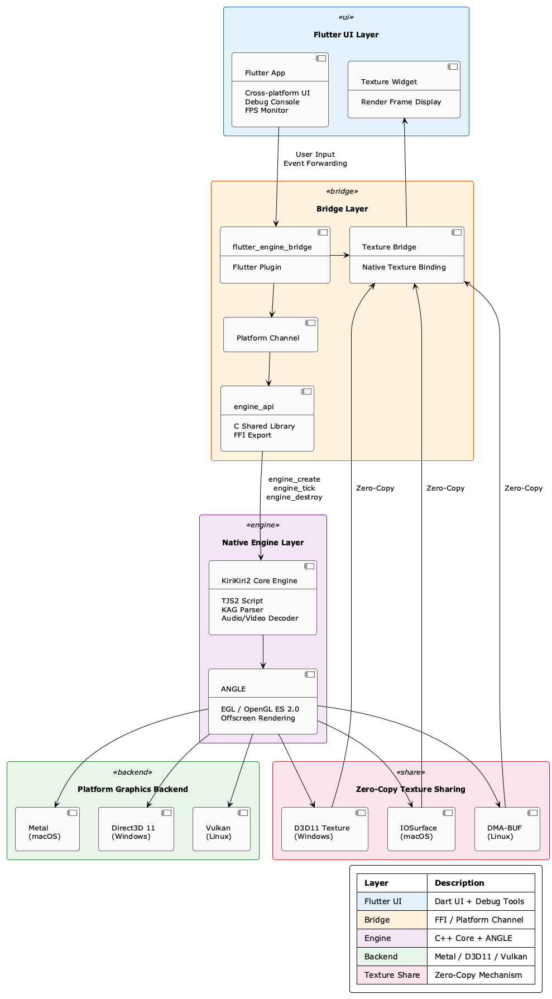

# KrKr2-Next-no-vcpkg
[Very WIP and NOT RECOMMENDED] My KrKr2-Next fork for Android, without vcpkg, flutter, ffmpeg and boost

## Ref
* https://github.com/reAAAq/KrKr2-Next  
* https://github.com/panreyes/pixtudio/tree/master/3rdparty  

## How to build for Android ADT
* cd android_adt/jni
* Double click console.bat
```
::@set PATH=D:\android-ndk-r9c;%PATH%
::@set PATH=D:\android-ndk-r10e;%PATH%
@set PATH=D:\home\soft\android_studio_sdk\ndk\25.2.9519653;%PATH%
@set NDK_MODULE_PATH=%CD%\..\..\cpp
@cmd
```
* ndk-build clean
* ndk-build -j8 (or ndk-build NDK_DEBUG=1 -j8, see adb_logcat_and_debug_crash.txt)
* Get libengine_api.so under android_adt/libs/arm64-v8a/libengine_api.so
* Use Android ADT to load android_adt/jni/.project
* Compile apk file and install it to the Android device, **Now only support ARM64 Android device**   

## How to build for Flutter (NOT RECOMMENDED)  
* Build android_adt/libs/arm64-v8a/libengine_api.so through ndk-build in 【How to build for Android ADT】 
* Copy android_adt/libs/arm64-v8a/libengine_api.so to apps/flutter_app/android/app/libs/arm64-v8a/libengine_api.so
* Double click apps/flutter_app/console.bat (modify it by yourself)  
```
@set PUB_HOSTED_URL=https://pub.flutter-io.cn
@set FLUTTER_STORAGE_BASE_URL=https://storage.flutter-io.cn
@set ANDROID_HOME=D:\home\soft\android_studio_sdk
@set PATH=D:\flutter_windows_3.41.4-stable\flutter\bin;C:\Program Files\Git\bin;%PATH%
@cmd

::flutter --version
::cd xxx\apps\flutter_app
::(not need) flutter pub get
::flutter build apk --verbose
```
* flutter build apk (no need to run flutter pub get)
* Get apk file, install it to the Android device, **Now only support ARM64 Android device**        

# Original README.md

<p align="center">
  <h1 align="center">KrKr2 Next</h1>
  <p align="center">基于 Flutter 重构的下一代 KiriKiri2 跨平台模拟器</p>
</p>

<p align="center">
  
  
  
  
  
</p>

---

**语言 / Language**: 中文 | [English](README_EN.md)

> 🙏 本项目基于 [krkr2](https://github.com/2468785842/krkr2) 重构，感谢原作者的贡献。

## 简介

**KrKr2 Next** 是 [KiriKiri2 (吉里吉里2)](https://zh.wikipedia.org/wiki/%E5%90%89%E9%87%8C%E5%90%89%E9%87%8C2) 视觉小说引擎的现代化跨平台运行环境。它完全兼容原版游戏脚本，使用现代图形接口进行硬件加速渲染，并在渲染性能和脚本执行效率上做了大量优化。基于 Flutter 构建统一的跨平台界面，支持 macOS · iOS · Windows · Linux · Android 五大平台。

下图为当前在 macOS 上通过 Metal 后端运行的实际效果：

<p align="center">
  
</p>

## 架构

<p align="center">
  
</p>

**渲染管线**：引擎通过 ANGLE 的 EGL Pbuffer Surface 进行离屏渲染（OpenGL ES 2.0），渲染结果通过平台原生纹理共享机制（macOS → IOSurface、Windows → D3D11 Texture、Linux → DMA-BUF）零拷贝传递给 Flutter Texture Widget 显示。


## 开发进度

> ⚠️ 本项目处于活跃开发阶段，尚未发布稳定版本。macOS 平台进度领先。

| 模块 | 状态 | 说明 |
|------|------|------|
| C++ 引擎核心编译 | ✅ 完成 | KiriKiri2 核心引擎全平台可编译 |
| ANGLE 渲染层迁移 | ✅ 基本完成 | 替代原 Cocos2d-x + GLFW 渲染管线，使用 EGL/GLES 离屏渲染 |
| engine_api 桥接层 | ✅ 完成 | 导出 `engine_create` / `engine_tick` / `engine_destroy` 等 C API |
| Flutter Plugin | ✅ 基本完成 | Platform Channel 通信、Texture 纹理桥接 |
| Texture 零拷贝渲染 | ✅ 基本完成 | 通过平台原生纹理共享机制零拷贝传递引擎渲染帧到 Flutter |
| Flutter 调试 UI | ✅ 基本完成 | FPS 控制、引擎生命周期管理、渲染状态监控 |
| 输入事件转发 | ✅ 基本完成 | 鼠标 / 触控事件坐标映射转发到引擎 |
| 引擎性能优化 | 🔨 进行中 | SIMD 像素混合、GPU 合成管线、VM 解释器优化等 |
| 游戏兼容性优化 | 🔨 进行中 | 补全解析引擎、添加插件，阶段目标与 Z 大闭源版兼容性持平 |
| 原有 krkr2 模拟器功能移植 | 📋 规划中 | 将原有 krkr2 模拟器功能逐步移植到新架构 |

## 平台支持状态

| 平台 | 状态 | 图形后端 | 纹理共享机制 |
|------|------|----------|-------------|
| macOS | ✅ 基本完成 | Metal | IOSurface |
| iOS | 🔨 流程打通，正在优化和修复 OpenGL 渲染 | Metal | IOSurface |
| Windows | 📋 计划中 | Direct3D 11 | D3D11 Texture |
| Linux | 📋 计划中 | Vulkan / Desktop GL | DMA-BUF |
| Android | 🔨 流程跑通，优化中 | OpenGL ES / Vulkan | HardwareBuffer |

## 引擎性能优化

| 优先级 | 任务 | 状态 |
|--------|------|------|
| P0 | 像素混合 SIMD 化 ([Highway](https://github.com/google/highway)) | ✅ 完成 |
| P0 | 全 GPU 合成渲染管线 | 🔨 进行中 |
| P0 | TJS2 VM 解释器优化 (computed goto) | 📋 计划中 |
## 许可证

本项目基于 GNU General Public License v3.0 (GPL-3.0) 开源，详见 [LICENSE](./LICENSE)。
